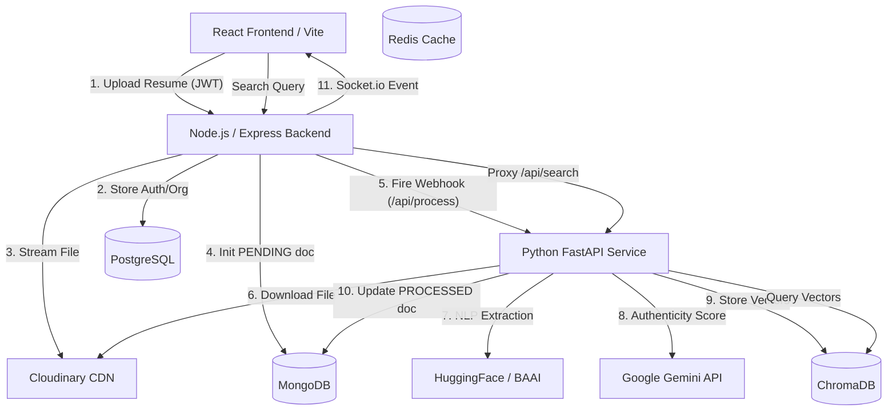

# AI Hiring Intelligence Platform - Production Handoff

This document outlines the architecture, deployment requirements, and operational flows for the newly refactored AI Hiring Intelligence Platform.

## 1. System Architecture

The platform utilizes a microservice, hybrid-storage architecture designed for scalability, asynchronous processing, and deep AI integration.



## 2. Technology Stack

### Frontend
*   **Framework:** React 18 with TypeScript and Vite
*   **State Management:** Redux Toolkit + Zustand
*   **Styling:** Tailwind CSS + Lucide Icons
*   **Real-time:** Socket.io-client

### Backend (Node.js API Gateway)
*   **Framework:** Express.js + TypeScript
*   **Relational ORM:** Prisma (PostgreSQL)
*   **Document ORM:** Mongoose (MongoDB)
*   **Storage:** Multer + Cloudinary
*   **Security:** JWT Authentication + Role-Based Access Control (RBAC)

### AI Service (Python Microservice)
*   **Framework:** FastAPI + Uvicorn
*   **NLP/Extraction:** PyMuPDF (`fitz`), SpaCy
*   **Embeddings:** `sentence-transformers` (`BAAI/bge-small-en-v1.5`)
*   **Vector Database:** ChromaDB
*   **Generative AI:** Google Generative AI (`gemini-1.5-flash`)

## 3. Local Startup Guide

Because this is a multi-service architecture, you must start several distinct processes.

### Prerequisites
1.  Running local **PostgreSQL** instance on `localhost:5432` (Database: `talentdb`).
2.  Running local **MongoDB** instance on `localhost:27017` (Database: `talentdb`).
3.  Running local **Redis** instance on `localhost:6379`.
4.  Cloudinary API keys.
5.  Google Gemini API key.

### Step 1: Database Initialization
Navigate to `backend-node` and sync the relational database:
```bash
cd backend-node
npx prisma generate
npx prisma db push
```

### Step 2: Start the Node.js API Gateway
In the `backend-node` directory:
```bash
npm install
npm run dev
```
*(Server will start on `http://localhost:5000`)*

### Step 3: Start the Python AI Service
In a new terminal, navigate to `ai-service`:
```bash
cd ai-service
python -m venv .venv

# Activate the virtual environment
# Windows:
.venv\Scripts\activate
# Mac/Linux:
# source .venv/bin/activate

pip install -r requirements.txt
uvicorn main:app --port 8000 --reload
```
*(Service will start on `http://localhost:8000`)*

### Step 4: Start the React Frontend
In a third terminal, navigate to `frontend`:
```bash
cd frontend
npm install
npm run dev
```
*(Frontend will start on `http://localhost:5173`)*

## 4. Core Capabilities

*   **Secure Ingestion:** Files bypass the Node.js disk entirely, streaming directly to Cloudinary.
*   **Async Processing:** Node.js never blocks on NLP tasks. It delegates them via webhook to FastAPI.
*   **Authenticity Scoring:** Gemini actively scans ingested resumes for keyword stuffing, AI-generated phrasing, and timeline impossibilities, generating a strict `0-100` score.
*   **Semantic Search:** Recruiters can search for "Senior Backend Devs with scaling experience" rather than relying on exact keyword matches. BAAI embeddings and ChromaDB handle the vector distances.
*   **Multi-Tenant Ready:** The Prisma schema requires `Organization` boundaries, preventing cross-tenant data leaks.
